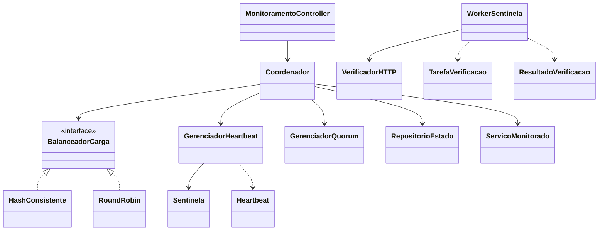

# Diagrama de classes (alvo)

```mermaid
classDiagram
class BalanceadorCarga {
 <<interface>>
}
BalanceadorCarga <|.. HashConsistente
BalanceadorCarga <|.. RoundRobin
Coordenador --> BalanceadorCarga
Coordenador --> GerenciadorHeartbeat
Coordenador --> GerenciadorQuorum
Coordenador --> RepositorioEstado
Coordenador --> ServicoMonitorado
MonitoramentoController --> Coordenador
GerenciadorHeartbeat --> Sentinela
GerenciadorHeartbeat ..> Heartbeat
WorkerSentinela --> VerificadorHTTP
WorkerSentinela ..> TarefaVerificacao
WorkerSentinela ..> ResultadoVerificacao
```
Coordenador, WorkerSentinela, RepositorioEstado e MonitoramentoController são classes planejadas.
